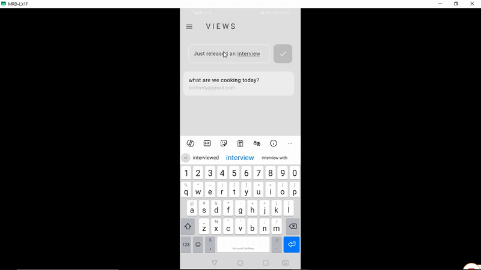

# 🚀 Birdie

# Description

An app to post thoughts and opinions as well as viewing other users thoughts and opinions.

---

## 🖼️ Demo

---

## 🧠 Tech Stack

**Frontend:** Dart, Flutter

**Backend:** Firebase

**Database:** Firestore

**Other Tools:** Git

---

## ⚙️ Setup Instructions

### 1. Clone the repo

git clone https://github.com/devdeejay27/birdie.git

cd birdie

### 2. Install dependencies

flutter clean

flutter pub get

### 3. Run the app in terminal

flutter run

## 👨‍💻 Author

Chukwudumeje Obieli

@devdeejay27

📧 dum_obieli@yahoo.com
